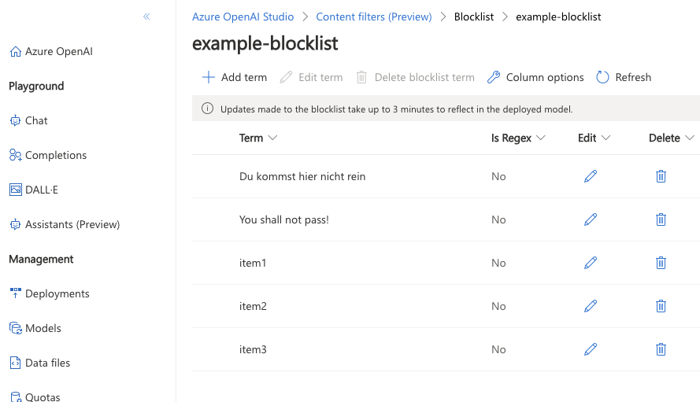
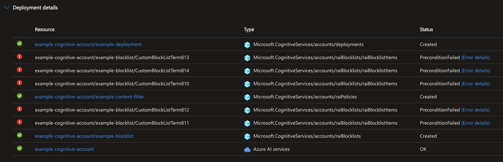

Azure OpenAI Deployment with Content Filter and Blocklist
=========================================================

This Bicep module deploys an Azure OpenAI model with a custom content filter and a blocklist.
This code is work in progress. Currently the 

> [!WARNING]
> This code base is still being developed. Currently, the resource can be deployed:  
> 
> 
> but there is an error after the deployment:
> 

Prerequisites
-------------

-   Azure subscription
-   Azure CLI installed
-   Bicep CLI installed

Usage
-----

1.  Clone the repository: git clone <https://github.com/aymenfurter/terraform-aoai-deployment-blocklist-sample.git> cd openai-deployment
2.  Log in to your Azure account using the Azure CLI: az login
3.  Set the target Azure subscription: az account set --subscription <subscription-id>
4.  Modify the `main.bicep` file in the root directory with your desired configuration.
5.  Add your blocklist items to the `blocklist_items.txt` file in the root directory, one item per line.
6.  Deploy the Bicep configuration: az deployment sub create --location <location> --template-file main.bicep Replace `<location>` with the desired Azure region for the deployment.
7.  After the deployment is complete, you can start using the Azure OpenAI model with the configured content filter and blocklist.

Parameters
----------

The following parameters can be configured in the `main.bicep` file:

-   `resourceGroupName`: The name of the resource group to create.
-   `location`: The location of the resources.
-   `cognitiveAccountName`: The name of the Cognitive Services account.
-   `cognitiveAccountSku`: The SKU of the Cognitive Services account (default: 'S0').
-   `deploymentName`: The name of the deployment.
-   `modelName`: The name of the OpenAI model.
-   `modelVersion`: The version of the OpenAI model.
-   `contentFilterName`: The name of the content filter.
-   `contentFilters`: The content filters configuration.
-   `filterConfig`: Additional filter configuration.
-   `blocklistName`: The name of the blocklist.
-   `blocklistDescription`: The description of the blocklist.

Blocklist Items
---------------

The blocklist items are defined in the `blocklist_items.txt` file, with each item on a separate line. The module will create a blocklist item for each line in the file.

Outputs
-------

After the deployment is complete, you can retrieve the following outputs:

-   `cognitiveAccountId`: The resource ID of the Cognitive Services account.
-   `deploymentId`: The resource ID of the OpenAI deployment.
-   `blocklistId`: The resource ID of the blocklist.

These outputs can be accessed using the `az deployment sub show` command with the `--query` parameter.
